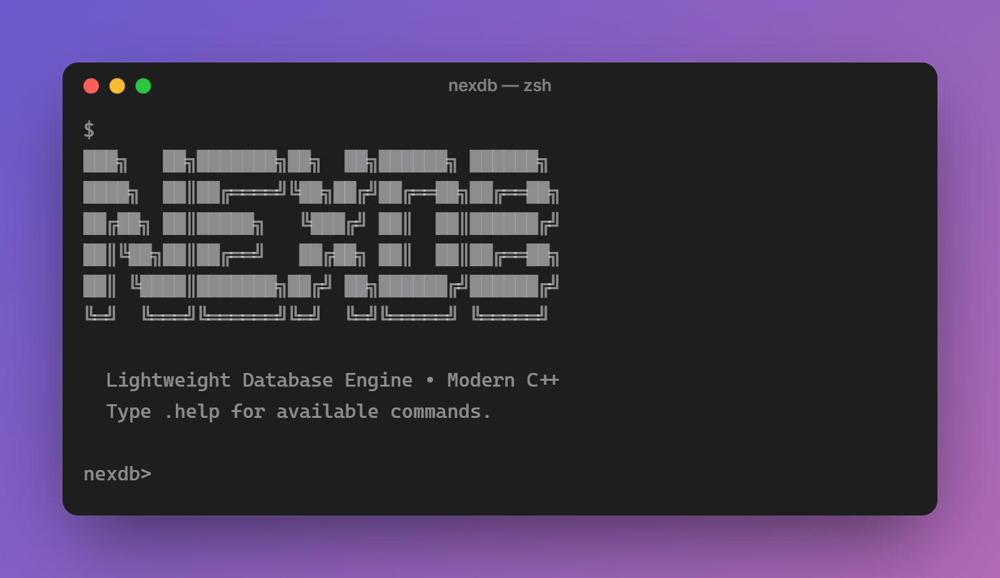
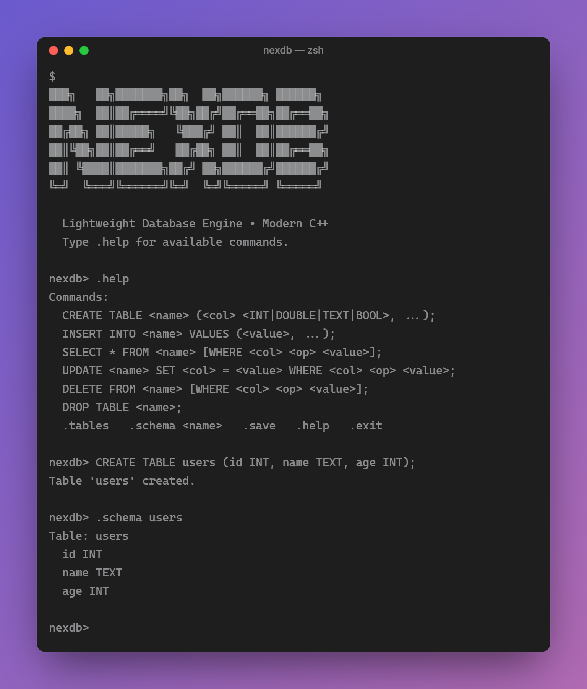
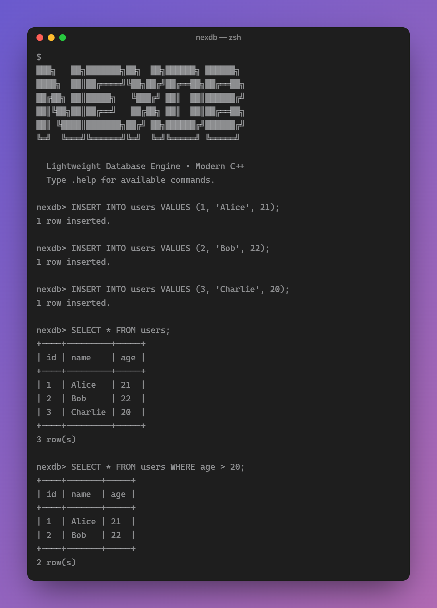

# NexDB

### A Lightweight Database Engine Built from Scratch in Modern C++

<p align="center">
  <strong>NexDB</strong> is a lightweight, SQL-inspired database engine built from the ground up using modern C++.
  <br>
  It was developed to explore the internal concepts behind database systems while demonstrating practical C++ programming, data structures, parsing, persistence, and software engineering.
</p>

<p align="center">
  
  
  
  
</p>

---

## 📸 Screenshots

### NexDB CLI

<!-- Replace with your actual screenshot -->



---

### Creating and Inserting Data

<!-- Replace with your actual screenshot -->



---

### Querying Data

<!-- Replace with your actual screenshot -->



---

## 🎯 About the Project

NexDB is an educational database engine designed and implemented from scratch in C++.

Instead of simply interacting with an existing database, NexDB explores the fundamental pipeline involved in a database system:

```text
User Input
    │
    ▼
SQL-like Parser
    │
    ▼
Query Processing
    │
    ▼
Database Engine
    │
    ├── Tables
    ├── Schemas
    └── Records
    │
    ▼
Persistent Storage
    │
    ▼
Disk
```

The project intentionally keeps the scope manageable while implementing a complete working cycle:

```text
CREATE → INSERT → SELECT → UPDATE → DELETE
                         ↓
                     PERSIST
                         ↓
                      RELOAD
```

---

# ✨ Features

### Database Operations

- Create tables
- Drop tables
- Insert records
- Select records
- Update records
- Delete records
- Display available tables
- Display table schemas

### Data Types

NexDB supports:

- `INT`
- `DOUBLE`
- `TEXT`
- `BOOL`

### Query Filtering

The `WHERE` clause supports:

```text
=
!=
<
<=
>
>=
```

Example:

```sql
SELECT * FROM students WHERE marks > 90;
```

### Persistence

Database contents can be saved to disk and restored when NexDB starts again.

```text
Runtime Memory
      ↓
   .save
      ↓
 Persistent Storage
      ↓
 Restart NexDB
      ↓
 Data Restored
```

### Interactive CLI

NexDB provides a simple command-line interface with built-in commands:

```text
.tables
.schema
.help
.save
.exit
```

### Testing

The project includes automated tests using CTest.

---

# 💻 Example

Start NexDB:

```text
nexdb>
```

Create a table:

```sql
CREATE TABLE students (id INT, name TEXT, marks INT);
```

Insert records:

```sql
INSERT INTO students VALUES (101, "Rahul", 92);
INSERT INTO students VALUES (102, "Ananya", 87);
INSERT INTO students VALUES (103, "Arjun", 95);
```

View the data:

```sql
SELECT * FROM students;
```

Example output:

```text
+-----+--------+-------+
| id  | name   | marks |
+-----+--------+-------+
| 101 | Rahul  | 92    |
| 102 | Ananya | 87    |
| 103 | Arjun  | 95    |
+-----+--------+-------+
```

Filter records:

```sql
SELECT * FROM students WHERE marks > 90;
```

Update a record:

```sql
UPDATE students SET marks = 96 WHERE id = 103;
```

Delete a record:

```sql
DELETE FROM students WHERE id = 102;
```

Save the database:

```text
.save
```

Exit:

```text
.exit
```

---

# 🧠 C++ Concepts Demonstrated

NexDB was designed to apply practical C++ concepts in a real software project.

## Object-Oriented Programming

- Classes and objects
- Encapsulation
- Abstraction
- Constructors and destructors
- Composition

## STL

The project makes practical use of standard library facilities such as:

```cpp
std::vector
std::string
std::unordered_map
std::map
std::variant
std::optional
std::filesystem
```

## Modern C++

- `auto`
- Range-based loops
- Lambda expressions
- `std::variant`
- `std::optional`
- Move semantics
- RAII
- `const` correctness
- `enum class`
- Structured bindings
- Exception handling

## File Handling

- File streams
- Serialization
- Deserialization
- Persistent storage
- File-system operations

## Data Structures & Algorithms

- Dynamic arrays
- Hash-based lookup
- Maps
- Searching
- Filtering
- Record management

---

# 🏗️ Architecture

```text
                       ┌─────────────────┐
                       │    NexDB CLI     │
                       └────────┬────────┘
                                │
                                ▼
                       ┌─────────────────┐
                       │   SQL Parser    │
                       └────────┬────────┘
                                │
                                ▼
                       ┌─────────────────┐
                       │ Query Processor │
                       └────────┬────────┘
                                │
                    ┌───────────┴───────────┐
                    │                       │
                    ▼                       ▼
             ┌──────────────┐       ┌──────────────┐
             │    Tables    │       │   Schemas    │
             └──────┬───────┘       └──────────────┘
                    │
                    ▼
             ┌──────────────┐
             │    Records   │
             └──────┬───────┘
                    │
                    ▼
             ┌──────────────┐
             │    Storage   │
             └──────┬───────┘
                    │
                    ▼
             ┌──────────────┐
             │     Disk     │
             └──────────────┘
```

---

# 📂 Project Structure

```text
NexDB/
│
├── include/
│   └── NexDB.hpp
│
├── nexdb/
│   ├── main.cpp
│   ├── Database.cpp
│   ├── Parser.cpp
│   └── Storage.cpp
│
├── tests/
│   └── test_nexdb.cpp
│
├── data/
│   └── .gitkeep
│
├── screenshots/
│   ├── cli.png
│   ├── create-table.png
│   └── query-results.png
│
├── CMakeLists.txt
├── README.md
├── CHANGELOG.md
├── demo.sql
├── LICENSE
└── .gitignore
```

---

# ⚙️ Requirements

To build NexDB, you need:

- C++17 compatible compiler
- CMake 3.15 or newer
- Git

### Recommended

- GCC 9+
- Clang 10+
- MSVC 2019+

Check your compiler:

```bash
g++ --version
```

Check CMake:

```bash
cmake --version
```

---

# 🚀 Installation

## 1. Clone the Repository

```bash
git clone https://github.com/manishdotin/NexDB.git
```

Navigate into the project:

```bash
cd NexDB
```

---

# 🔨 Build

Create a build directory:

```bash
mkdir build
cd build
```

Configure the project:

```bash
cmake ..
```

Build:

```bash
cmake --build .
```

---

# ▶️ Run NexDB

## Windows

For a Visual Studio CMake generator:

```powershell
.\Debug\nexdb.exe
```

If using a MinGW generator:

```powershell
.\nexdb.exe
```

## Linux / macOS

```bash
./nexdb
```

# 🧪 Run Tests

From the build directory:

```bash
ctest --output-on-failure
```

Expected result:

```text
100% tests passed
```

---

# 📝 Demo

A sample SQL session is provided in:

```text
demo.sql
```

It demonstrates basic NexDB operations including:

```text
CREATE TABLE
INSERT
SELECT
WHERE
UPDATE
DELETE
.save
```

---

# 💾 Persistence

NexDB supports persistent storage.

When `.save` is executed, the current database state is written to disk.

After closing and restarting NexDB, the stored tables and records can be loaded again.

Example:

```text
Session 1
─────────

nexdb> INSERT INTO students VALUES (101, "Rahul", 92);
nexdb> .save
nexdb> .exit


Session 2
─────────

nexdb> .tables

students

nexdb> SELECT * FROM students;

101 | Rahul | 92
```

This demonstrates the basic persistence lifecycle:

```text
Create
  ↓
Modify
  ↓
Save
  ↓
Exit
  ↓
Restart
  ↓
Load
  ↓
Continue Working
```

---

# 🧪 Testing Strategy

The project includes automated tests covering important database functionality.

Testing focuses on:

- Table creation
- Record insertion
- Record retrieval
- Filtering
- Updates
- Deletions
- Data persistence
- Parser behavior

Tests can be executed using:

```bash
ctest --output-on-failure
```

---

# 🛣️ V1 Scope

NexDB V1 intentionally focuses on building a **small but complete database engine** rather than attempting to reproduce a production database.

### Included in V1

- [x] Database representation
- [x] Tables
- [x] Schemas
- [x] Typed records
- [x] SQL-like parser
- [x] CREATE TABLE
- [x] INSERT
- [x] SELECT
- [x] WHERE
- [x] UPDATE
- [x] DELETE
- [x] DROP TABLE
- [x] CLI commands
- [x] Persistent storage
- [x] CMake build system
- [x] Automated tests

### Intentionally Outside V1

The following are not part of the V1 scope:

- Transactions
- Concurrent queries
- Multi-user access
- Network database server
- Full SQL compatibility
- JOIN operations
- Query optimizer
- B+ Tree indexing
- ACID transaction guarantees
- Production-level crash recovery
- Distributed storage

These limitations are intentional and keep NexDB focused as an educational database-engine project.

---

# 📚 Learning Outcomes

Building NexDB provided practical experience with:

```text
C++
│
├── Object-Oriented Programming
├── STL
├── Generic Programming
├── Memory Management
├── RAII
├── File I/O
├── Exception Handling
├── Data Structures
├── Parsing
├── Serialization
├── CMake
├── Testing
└── Git / GitHub
```

More importantly, the project connects these concepts into a single working system.

---

# 🔍 Design Philosophy

### Understand Before Implementing

Each component exists to solve a specific problem within the database engine.

### Keep the Architecture Modular

Parsing, database logic, and storage are separated to make the project easier to understand and maintain.

### Prefer Standard C++

NexDB relies primarily on the C++ standard library instead of external frameworks.

### Keep the Scope Controlled

The objective of V1 is not to build a replacement for MySQL or PostgreSQL.

The objective is to understand the fundamental building blocks of a database engine through implementation.

---

# 📈 Future Possibilities

NexDB V1 is considered complete.

Possible directions for a future version could include:

- B+ Tree indexing
- Query optimization
- JOIN operations
- Transactions
- Concurrency
- More advanced storage formats
- Networking
- Client-server architecture

These are deliberately **not implemented in V1**.

---

# 🎓 Project Purpose

NexDB was created as a C++ learning and portfolio project to demonstrate the ability to take a complex software concept, break it into manageable components, and implement a functional system from scratch.

It combines:

**C++ + Data Structures + Algorithms + Parsing + Storage + Software Engineering**

into one cohesive project.

---

# ⚠️ Disclaimer

NexDB is an educational project and is **not intended for production database workloads**.

It should not be used as a replacement for established database systems such as SQLite, MySQL, PostgreSQL, or other production-grade database technologies.

---

# 👨‍💻 Author

**Manish S**

---

# 📄 License

This project is licensed under the **MIT License**.

See the [`LICENSE`](LICENSE) file for details.

---

<p align="center">

### ⭐ If you found NexDB interesting, consider starring the repository!

**Thank You !**

</p>